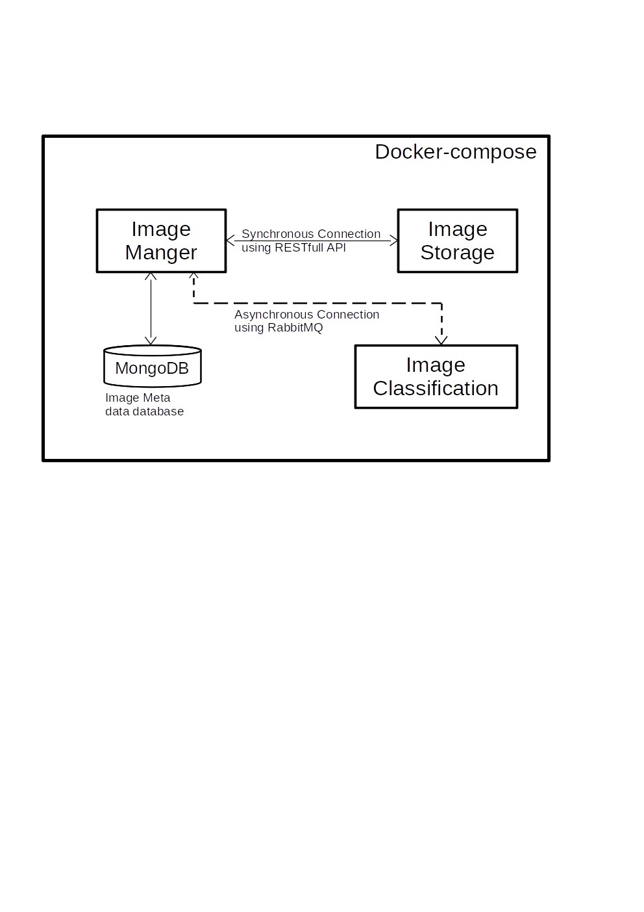

# image-maneger-microservices-app
image maneger microservices application

Microservices application for image storage, stored in plain form or encrypted form, with it’s meta data and automatic tagging using Deep learning techniques. 

## It's microservices as follow:

### Image-Classification micro-service:
This micro-service is responsible for classifying images using ResNet18 other services can communicate with it using synchronous communication by 
requesting it RESTfull API or through asynchronous communication using RabbitMQ.

built with:` Python, Pytorch, Flask, and pika`.

### Image-Storage micro-service:

this micro-service is responsible for storing the images the users in either plain or encrypted, using AES, form other microservices can communicate with it using it’s RESTfull API. 

built with: `NodeJS, Express, Multer,axios, and crypto`.

### Image-manager micro-service:
This micro-service is responsible for 1) storing the meta-data, such as Image’s owner and the image Tags, automatically added by Image Classification micro-service, and the total number of views, 2) manage users, users credentials and authentication 3) communicate with Image-Classification microservice using RabbitMQ and With Image-Storage through it’s RESTfull API.

built with: `NodeJS, Express, Mongoose, JWT, bcrypt, amqplib, axios, and Joi`.

### Service-Registry micro-service:
This micro-service is responsible for 1) services Registry: where other micro-services register it's service-name, version, port, and it's hostname.
2) services discovery: responible for responding with the hastname and port of the required services. 3)load balancing between multiple instances of the sengle service.
every service should periodically renew it's registry as for every registry entry it have max age after which it will be automatically deleted.

built with: `NodeJS, Express, Mongoose, axios, and semver`.

### Route-Advertisement micro-service:
To avoid manually adjust API Gateway to add public route route-advertiment (RA) manages all routes from the entire micro-service application. Any service wants to advertise a specific public route it can HTTP POST this route to RA through it's RESTfull API. RA assumes order of routes does not matter. RA allows dynamically adding routes to the Api Gateway. 

built with: `NodeJS, Express, Mongoose, axios, and JWT`.

### Api Gateway micro-service
Api Gateway (GW) micro-service periodically request new added routes to route-advertisement. Every GW is responsible of keep tracking it's state and request missed routes.

built with: `NodeJS, Express, Mongoose, axios, and cron`.

## Get Started

`sudo docker compose up`

