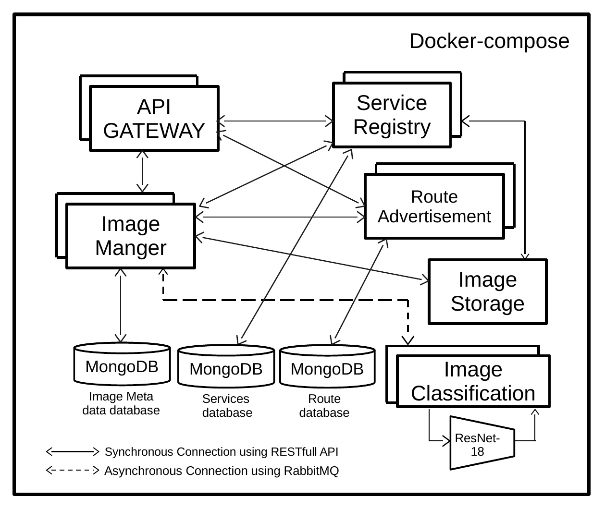

# image-maneger-microservices-app
image maneger microservices application

Microservices application for image storage, stored in plain form or encrypted form, with it’s meta data and automatic tagging using Deep learning techniques. 

## It consists of three microservices as follow:

### Image-Classification micro-service:
This micro-service is responsible for classifying images using ResNet18 other services can communicate with it using synchronous communication by 
requesting it RESTfull API or through asynchronous communication using RabbitMQ.

built with:` Python, Pytorch, Flask, and pika`.

### Image-Storage micro-service:

this micro-service is responsible for storing the images the users in either plain or encrypted, using AES, form other microservices can communicate with it using it’s RESTfull API. 

built with: `NodeJS, Express, Multer, and crypto`.
### Image-manager micro-service:
This micro-service is responsible for 1) storing the meta-data, such as Image’s owner and the image Tags, automatically added by Image Classification micro-service, and the total number of views, 2) manage users, users credentials and authentication 3) communicate with Image-Classification microservice using RabbitMQ and With Image-Storage through it’s RESTfull API.

built with: `NodeJS, Express, Mongoose, JWT, bcrypt, amqplib, and Joi`.

